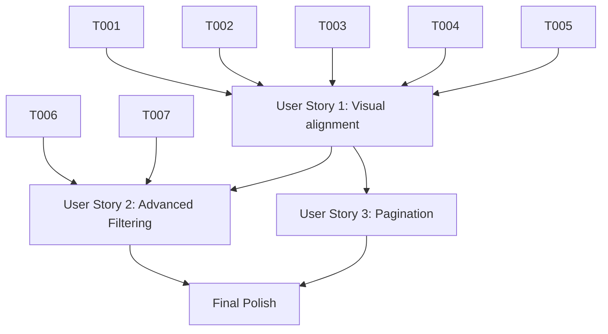

# Implementation Tasks: UI Style Alignment (Atelier Design)

**Feature**: UI Style Alignment  
**Plan**: [specs/002-ui-style-alignment/plan.md](plan.md)  
**Branch**: `002-ui-style-alignment`

## Implementation Strategy

This feature will be implemented incrementally, starting with the foundational data model changes and theme setup, followed by a priority-ordered implementation of the user stories. We will prioritize the visual "hero" experience (US1) first to establish the brand identity, then move to functional improvements (US2, US3).

- **MVP Scope**: Complete Phase 1-3 to deliver the visually aligned product listing page.
- **Incremental Delivery**: Each User Story phase results in an independently testable and valuable increment.

## Phase 1: Setup

Goal: Initialize design tokens and typography.

- [x] T001 [P] Configure Tailwind CSS theme and design tokens (colors: #fcf9f8, #323233, etc.) in `src/tailwind.config.js`
- [x] T002 [P] Add Google Fonts (Manrope, Work Sans) and backdrop-blur support in `src/Pages/Shared/_Layout.cshtml`

## Phase 2: Foundational

Goal: Extend the data model to support new design attributes.

- [x] T003 Update `Product` entity with `Material` and `Color` fields in `src/Models/Product.cs`
- [x] T004 Create and apply EF Core migration `AddMaterialAndColorToProduct`
- [x] T005 Update `DbInitializer.cs` to seed products with Atelier-specific material and color data
- [x] T006 Update `ProductDto` to include `Material` and `Color` properties in `src/Models/Dtos/Dtos.cs`
- [x] T007 Update `IProductService.cs` and `ProductService.cs` to support filtering by Material and Color

## Phase 3: User Story 1 - High Fidelity Product Browsing (P1)

Goal: Achieve 1:1 visual match for the hero section and product grid.

- **Independent Test**: Navigate to `/Products/Index` and verify visual parity with Figma (Typography, Spacing, Asymmetrical Grid).

- [x] T008 [US1] Implement sticky header with backdrop blur and Atelier branding in `src/Pages/Shared/_Layout.cshtml`
- [x] T009 [US1] Implement Hero section with "THE WINTER COLLECTION" typography in `src/Pages/Products/Index.cshtml`
- [x] T010 [US1] Create asymmetrical product grid using Tailwind nth-child offsets in `src/Pages/Products/Index.cshtml`
- [x] T011 [US1] Update product card layout to show Material (uppercase) and Price in `src/Pages/Products/Index.cshtml`
- [x] T012 [P] [US1] Implement hover-activated "Quick View" button overlay in `src/Pages/Products/Index.cshtml`

## Phase 4: User Story 2 - Advanced Filtering (P2)

Goal: Enable sidebar filtering by Material and Color.

- **Independent Test**: Interact with Material and Color filters in the sidebar and verify product list updates.

- [x] T013 [US2] Update `IndexModel` to handle `material` and `color` query parameters in `src/Pages/Products/Index.cshtml.cs`
- [x] T014 [US2] Implement Material checkbox list filter in `src/Pages/Products/Index.cshtml` sidebar
- [x] T015 [US2] Implement Color swatch button filter in `src/Pages/Products/Index.cshtml` sidebar
- [x] T016 [US2] Ensure filter persistence across category, search, and pagination in `src/Pages/Products/Index.cshtml`

## Phase 5: User Story 3 - Pagination & Discovery (P3)

Goal: Styled pagination and "Load More" functionality.

- **Independent Test**: Navigate pages using the new pagination UI and click "Load More" to append items.

- [x] T017 [US3] Update pagination UI to match Atelier design (underlines and spacing) in `src/Pages/Products/Index.cshtml`
- [x] T018 [US3] Implement "Load More Essentials" button with styled background in `src/Pages/Products/Index.cshtml`

## Phase 6: Polish & Cross-Cutting

Goal: Final branding and responsive refinements.

- [x] T019 [P] Implement 4-column footer with branding and legal links in `src/Pages/Shared/_Layout.cshtml`
- [ ] T020 Final responsive pass and visual regression check against Figma

## Dependency Graph

## Parallel Execution Examples

- **UI Development**: T008, T009, T012 can be developed in parallel as they touch different parts of the layout.
- **Data Foundation**: T001, T002 can be set up while T003-T005 are being handled in the backend.
