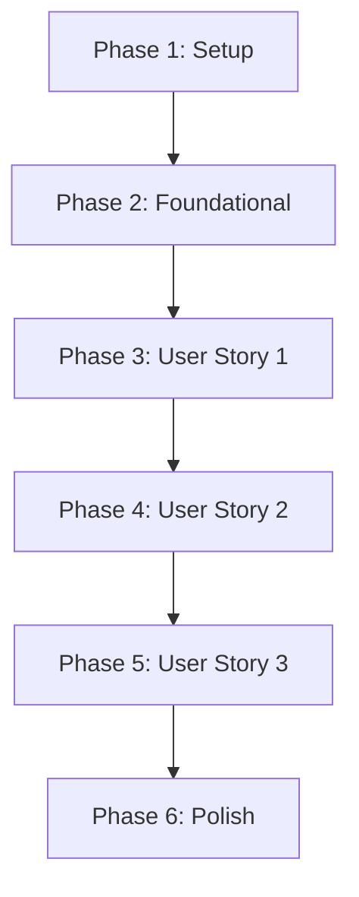

# Tasks: Reset Product Filters

**Feature**: Reset Product Filters
**Status**: Ready
**Generated**: 2026-04-11

## Implementation Strategy

This feature will be implemented incrementally, prioritizing the core toggle logic (User Story 1) before expanding to multi-select and complex reset scenarios. We use a Web API for the backend to ensure performance and separation of concerns, and the History API on the frontend for a seamless "silent" URL update experience.

## Phase 1: Setup

Goal: Initialize the technical foundation for API and AJAX communication.

- [ ] T001 Create `src/Models/Dtos/FilterDtos.cs` with `FilterRequest`, `FilteredResult`, and `FacetCounts` DTOs
- [ ] T002 Create `src/Controllers/ProductsController.cs` skeleton with a GET method following the contract
- [ ] T003 Create `src/wwwroot/js/product-filter.js` and link it in `src/Pages/Shared/_Layout.cshtml`

## Phase 2: Foundational

Goal: Implement the core filtering service and data access logic.

- [ ] T004 [P] Implement `IProductService.GetFilteredProductsAsync` in `src/Services/IProductService.cs`
- [ ] T005 Implement filtering logic with EF Core and `AsNoTracking()` in `src/Services/ProductService.cs`
- [ ] T006 [P] Add unit tests for `ProductService.GetFilteredProductsAsync` in `tests/unit/ProductServiceTests.cs`
- [ ] T007 Complete the `GET /api/products` endpoint in `src/Controllers/ProductsController.cs` calling the service

## Phase 3: User Story 1 - Deselect Single Filter (Priority: P1)

Goal: Enable basic toggle functionality for a single filter item.

**Independent Test**: Apply a single filter via the sidebar, then click it again. The list must return to its original state and the visual highlight must disappear.

- [ ] T008 [US1] Implement `filterState` object and `toggleFilter` function in `src/wwwroot/js/product-filter.js`
- [ ] T009 [US1] Implement `updateProductList` function using `fetch()` to call the API in `src/wwwroot/js/product-filter.js`
- [ ] T010 [US1] Add click event listeners to filter items in `src/Pages/Products/Index.cshtml` (or sidebar partial)
- [ ] T011 [US1] Implement visual toggle logic (adding/removing CSS classes) in `src/wwwroot/js/product-filter.js`

## Phase 4: User Story 2 - Partial Reset with Multiple Filters (Priority: P2)

Goal: Support independent toggling of multiple filters with OR logic.

**Independent Test**: Select two filters from different groups. Deselect one and verify the other remains active and the list updates correctly.

- [ ] T012 [US2] Update `toggleFilter` logic to support multiple active selections per group in `src/wwwroot/js/product-filter.js`
- [ ] T013 [US2] Update `ProductService.cs` to handle multiple values per category using OR logic
- [ ] T014 [US2] Ensure `updateProductList` correctly reflects partial state changes in the UI

## Phase 5: User Story 3 - Full Reset via Manual Deselection (Priority: P3)

Goal: Ensure a sequence of deselections leads back to the default state while preserving search/sort.

**Independent Test**: Apply filters and a sort order. Deselect all filters one by one. The final view must be sorted but unfiltered.

- [ ] T015 [US3] Implement `History.pushState` integration in `src/wwwroot/js/product-filter.js` to sync URL with `filterState`
- [ ] T016 [US3] Ensure `filterState` preserves `SearchTerm` and `SortOrder` when filters are cleared in `src/wwwroot/js/product-filter.js`
- [ ] T017 [US3] Implement `popstate` event listener to handle browser back/forward buttons in `src/wwwroot/js/product-filter.js`

## Phase 6: Polish & Cross-Cutting

Goal: Add real-time counts, loading states, and finalize the experience.

- [ ] T018 Implement dynamic facet count updates in `src/wwwroot/js/product-filter.js` using data from the API response
- [ ] T019 Add a loading spinner or skeleton UI in `src/Pages/Products/Index.cshtml` during AJAX requests
- [ ] T020 [P] Implement integration tests for the full filter flow in `tests/integration/FilterFlowTests.cs`
- [ ] T021 Perform final audit of `ILogger` usage for filter operations in `src/Controllers/ProductsController.cs`

## Dependency Graph

## Parallel Execution Examples

- **Foundational**: T004 (Interface) and T006 (Tests) can be started in parallel once DTOs (T001) are defined.
- **UI & API**: T007 (Controller) and T008 (JS State) can be developed in parallel after the Service (T005) is stable.
- **Testing**: T020 (Integration Tests) can be developed in parallel with Polish tasks.
